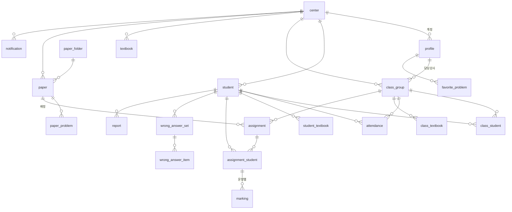

# 학원·계정 도메인 설계 (OPER-141)

메타수학 학원 포털 화면 38개에서 추출한 API 121개·필드 279개를 바탕으로, 풀잇 학원 포털의 Postgres 스키마와 RLS(학원 단위 격리) 정책을 정의한 문서. 실제 DDL은 [`supabase/migrations/0001_domain.sql`](../../supabase/migrations/0001_domain.sql).

## 1. 설계 원칙

| 원칙 | 내용 |
|---|---|
| 학원 격리 | 모든 업무 테이블에 `center_id` 를 두고 RLS 로 `center_id = current_center_id()` 강제. 조인 없이 정책이 평가되도록 하위 테이블(class_student, marking 등)에도 `center_id` 를 중복 저장 |
| 인증 | Supabase Auth. 로그인 주체는 학원 계정(원장·강사)뿐. 학생은 로그인하지 않는 데이터 행 (학생 포털은 범위 제외) |
| 문항 참조 | `problem_code` 텍스트(예: `math_2022_1_1_1_0001`)로 참조. 문항 테이블은 0002(OPER-140)에서 만들고 FK 추가 |
| 삭제 | 문제지는 `deleted_at` 소프트 삭제(휴지통). 나머지는 FK cascade |
| 스냅샷 | 리포트는 생성 시점 데이터를 `payload` JSONB 로 고정. 이후 채점이 바뀌어도 발송한 리포트는 유지 |

## 2. ERD

## 3. 테이블 요약

### 3.1 학원·계정

| 테이블 | 역할 | 핵심 컬럼 | 메타수학 대응 |
|---|---|---|---|
| `center` | 학원 | name, owner_name, tel, address, logo_url, slogan, report_style | mng/center/centerinfo · centeredit |
| `profile` | 학원 계정 (auth.users 1:1) | center_id, role(owner/teacher), name, phone, email, access_menu(jsonb), is_active | mng/teacher/*, mypage/profileinfo |

원장(owner)과 강사(teacher)를 한 테이블에 두고 `role` 로 구분. 메타수학의 강사별 메뉴 권한(`f_access_menu`)은 `access_menu` JSONB 로 보존.

### 3.2 학생·반·출석·교재

| 테이블 | 역할 | 핵심 컬럼 | 메타수학 대응 |
|---|---|---|---|
| `student` | 학생 | name, grade(h1/h2/h3/n/etc), phone, parent_name, parent_phone, address, memo, state(active/paused/left), study_level, entered_at | mng/student/* |
| `class_group` | 반 | name, teacher_id, grade, subject, room, schedule(jsonb), start_date, end_date, is_active | mng/group/* |
| `class_student` | 반-학생 | class_id, student_id, joined_at | mng/group/groupstudentedit |
| `attendance` | 출석 | student_id, class_id, attended_on, status(present/late/absent/excused), memo | mng/attendance/* (SMS 발송은 제외) |
| `textbook` | 교재 라벨 | name, publisher, subject | mng/book/* |
| `class_textbook` / `student_textbook` | 교재 배정 | — | mng/book/grouplist · studentbooklist |

메타수학의 학년 코드(`f_grade_cd`)는 `grade_code` enum 으로 축소. 반 시간표(`f_week`, `f_start_hhmm`, `f_end_hhmm`)는 `schedule` JSONB 배열 `[{"week":1,"start":"19:00","end":"21:00"}]` 로 저장.

### 3.3 문제지

| 테이블 | 역할 | 핵심 컬럼 | 메타수학 대응 |
|---|---|---|---|
| `paper` | 문제지 | name, subject, paper_type(custom/level_test/achievement_test/calculation), status, problem_count, total_score, options(jsonb), tags[], folder_id, is_favorite, is_shared, deleted_at | paper/mypaperlist · leveltest · achievementtest · calculation · trash |
| `paper_folder` | 즐겨찾기 폴더 | name | paper/favoritepaperlist · deleteselectedfavoritefolder |
| `paper_problem` | 문제지-문항 | paper_id, ord, problem_code, score(override) | paper/editpaperproc |
| `favorite_problem` | 즐겨찾기 문항 | user_id, problem_code | paper/favoriteproblemlist |

정답·해설 공개 옵션(`f_stu_openanswer_yn_*`, `f_stu_home_send_type`)은 `options` JSONB 에 담아 컬럼 증식을 막음.

### 3.4 배정·채점·오답·리포트

| 테이블 | 역할 | 핵심 컬럼 | 메타수학 대응 |
|---|---|---|---|
| `assignment` | 문제지 배정 | paper_id, class_id, assigned_by, assigned_at, due_at | clinic/grouppaper/* |
| `assignment_student` | 학생별 배정 | assignment_id, student_id, status(assigned/submitted/marked), correct_count, score, marked_at | clinic/studentpaper/* |
| `marking` | 문항별 채점 | assignment_student_id, problem_code, answer_index, is_correct | clinic/grouppaper/savemarkingpapers |
| `wrong_answer_set` / `wrong_answer_item` | 오답 모음 | student_id, name, paper_id / problem_code | clinic/studentpaper/*enotecollect* |
| `report` | 리포트 | student_id, kind(total/wrong/book), period, payload(jsonb) | clinic/report/* |
| `notification` | 알림 | user_id, kind, message, link, is_read | common/notification* |

## 4. RLS 정책

| 테이블 | select | insert | update | delete |
|---|---|---|---|---|
| 업무 테이블 전체 (student, class_group, paper, assignment, marking 등 18개) | 같은 학원 | 같은 학원 | 같은 학원 | 같은 학원 |
| `center` | 소속 학원 | service_role 만 (가입 처리) | 원장만 | 불가 |
| `profile` | 같은 학원 | 원장만 | 본인 또는 원장 | 원장만 (본인 제외) |

- `current_center_id()` : `auth.uid()` 의 profile.center_id 를 반환하는 security definer 함수. 모든 정책이 이 값과 `center_id` 를 비교
- `is_owner()` : 현재 사용자가 원장인지 반환
- 강사는 원장과 동일하게 학원 데이터 전체를 읽고 쓸 수 있음. 메뉴 단위 제한은 `profile.access_menu` 를 화면에서 해석 (DB 강제 아님). 1차 오픈 후 필요 시 정책 세분화
- 회원가입 시 center + profile(owner) 생성은 anon 키로 불가하므로 Next.js 서버 액션에서 service_role 로 처리

## 5. 메타수학 대비 축소·변경 사항

| 항목 | 메타수학 | 풀잇 |
|---|---|---|
| 학생 웹 계정(`f_web_id`, `f_access_pw`) | 학생 로그인 있음 | 없음 (학생 포털 범위 제외) |
| 학생 등록 제한(`f_student_limit`) | 계약별 학생 수 제한 | 없음 (결제 제외) |
| 출석 SMS(`attendancesms*`) | 있음 | 없음 |
| 리포트 카카오·SMS 발송(`f_send_kakao`, `f_send_sms`) | 있음 | 없음. PDF 다운로드만 |
| 교재 페이지 문항 조회(`bookpageproblemlist`) | 외부 엔진 | 없음. 교재는 라벨 |
| E-note 관련(`f_isenote`, `f_canenote_yn`) | 태블릿 필기 연동 | 없음 |
| 지사(`f_branch_id`) | 본사-지사 구조 | 없음. 단일 학원 |

## 6. 미결·확인 필요

| 항목 | 내용 |
|---|---|
| 강사 권한 세분화 | 1차는 원장과 동일 권한. 반별 접근 제한이 필요하면 `class_group.teacher_id` 기반 정책 추가 |
| 학생 로그인 | 추후 학생 포털을 열 경우 `student.auth_user_id` 컬럼 추가로 확장 가능 |
| 마이그레이션 검증 | 로컬 Postgres 없이 작성. OPER-138 완료 후 Supabase 에 적용하며 검증 |
